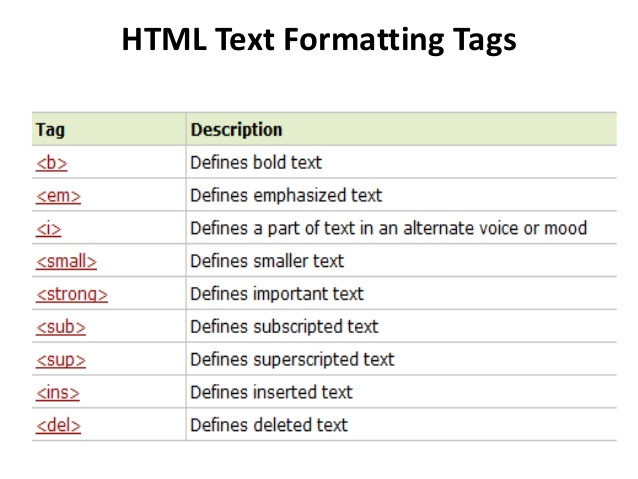

# Introduction to html 


When you start design your webpages with `html`, you start with the doc type then you add the main tags which are `html` tag, `head` tag, and `body` tag. Then you start implement the rest of informations that you want to appear to the users. You wanna make sure to display all these information in proper way and best design you can. Here we use the text tags that make our webpages more readable and more understand.

Adding **markup** to the text divided into two main parts:

1.  Structural markup: This type of markup is focused on the elements that you can use to describe both headings and paragraphs, like `<h1>` tag, `p` tag and other tags.

2.  Semantic markup: This type focused on provides extra information like `<strong>` tag which tell you that this text is very important, `<em>` tag which is emphasized text placed in a sentence and so on.

## HTML Text Formatting Tags 



# Introduction to CSS


## What is CSS?

* `CSS` stands for Cascading Style Sheets
* `CSS` describes how HTML elements are to be displayed on screen, paper, or in other media
* `CSS` saves a lot of work. It can control the layout of multiple web pages all at once

## What CSS does?

`CSS` is used to define styles for your web pages, including the design, layout and variations in display for different devices and screen sizes.

## CSS Syntax

```css
h1 {
    color:blue;
}
```

* h1: Selector
* color: Property
* blue: Value

## Ways to Insert CSS Into Our Webpages

1.  External `CSS` 

```html
<head>
<link rel="stylesheet" href="mystyle.css">
</head>
```

2.  Internal `CSS`

```html
<style>
body {
  background-color: linen;
}

h1 {
  color: maroon;
  margin-left: 40px;
}
</style>
</head>
```

3.  Inline `CSS`

```html
<body>

<h1 style="color:blue;text-align:center;">This is a heading</h1>
<p style="color:red;">This is a paragraph.</p>

</body>
```

# Introduction to javaScript


We have learned that scripts are a set of concepts, commands and instructions that we assign to the computer in order to achieve the goal that we seek from these instructions, but in order to achieve this, the user must use a programming language because the computer does not understand human language.

When writing the script, it is preferable to specify the goal of the program that we are writing, and then we write this program in a smooth and sequential manner, each step or each command separately, so that we do not get into the maze of programming errors and it is sometimes possible to rewrite the program, which is really cumbersome.

`javaScript` is a programming language commonly used in web development. It was originally developed to add dynamic and interactive elements to websites.

## Statements
`javaScript` statements are composed of values, operators, expressions, keywords, and comments and all of these statements work together to do a certain mission.

## Date types


## Expressions & Operators
An **expression** is any valid set of literals, variables, operators, and expressions that evaluates to a value. there are two types of expressions:

1. EXPRESSIONS THAT JUST ASSIGN A VALUE TO A VARIABLE

    ```java scipt
    var color = 'beige';
    ```

2. EXPRESSIONS THAT USE TWO OR MORE VALUES TO RETURN A SINGLE VALUE

    ```java scipt
    var area = 3 * 2;
    ```

An **Operator** performs some operation on single or multiple operands (data value) and produces a result.


* ASSIGNMENT OPERATORS

    ```java script
    color = 'beige';
    ```

* ARITHMETIC OPERATORS

    ```java script
    area = 3 * 2;
    ```

* STRING OPERATORS

    ```java script
    greeting= 'Hi 1 + 'Mol ly';
    ```

* COMPARISON OPERATORS

    ```java script
    buy = 3 > 5;
    ```

* LOGICAL OPERATORS

    ```java script
    buy= (5 > 3) && (2 < 4);
    ```

## Functions
**Function** is like a big box can hold many lines of code to perform a specific task. and you can use it in more than on place of your program.

#### Syntax


```java script

function name(parameter1, parameter2, parameter3) {
  // code to be executed
}

```


## Switch statement 


The switch statement is do the same as if statement work but in another syntax.


#### Syntax


```java script

switch(expression) {
  case x:
    // code block
    break;
  case y:
    // code block
    break;
  default:
    // code block
}


```