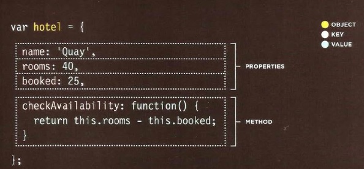

# Object-Oriented Programming, HTML Tables

## Domain Modeling

> Domain modeling is the process of creating a conceptual model in code for a specific problem. A model describes the various entities, their attributes and behaviors, as well as the constraints that govern the problem domain. An entity that stores data in properties and encapsulates behaviors in methods is commonly referred to as an object-oriented model.

### Points you have to consider when building domain models

* When modeling a single entity that'll have many instances, build self-contained objects with the same attributes and behaviors.
* Model its attributes with a constructor function that defines and initializes properties.
* Model its behaviors with small methods that focus on doing one job well.
* Create instances using the new keyword followed by a call to a constructor function.
* Store the newly created object in a variable so you can access its properties and methods from outside.
* Use the this variable within methods so you can access the object's properties and methods from inside.

## HTML Tables

> A table represents information in a grid format.
Examples of tables include financial reports, TV
schedules, and sports results.

```html

<table>
<tr>
<td>15</td>
<td>15</td>
<td>30</td>
</tr>
<tr>
<td>45</td>
<td>60</td>
<td>45</td>
</tr>
<tr>
<td>60</td>
<td>90</td>
<td>90</td>
</tr>
</table>

```

* `table`: The `<table>` element is used to create a table.

* `tr`: The `tr` stands for table row.

* `td`: The `td` stands for table data.

> You can make cells of a table span more than one row
or column using the rowspan and colspan attributes.

> For long tables you can split the table into a `<thead>`,
`<tbody>`, and `<tfoot>`.

## Object-Oriented Programming (OOP)

>JavaScript is not a class-based object-oriented language. But it still has ways of using object oriented programming (OOP).

> Objects group together a set of variables and functions to create a model of a something you would recognize from the real world. In an object, variables and functions take on new names.

### Creating literal object



### Creating constructor object


### Accessing an object


### Updating an object


