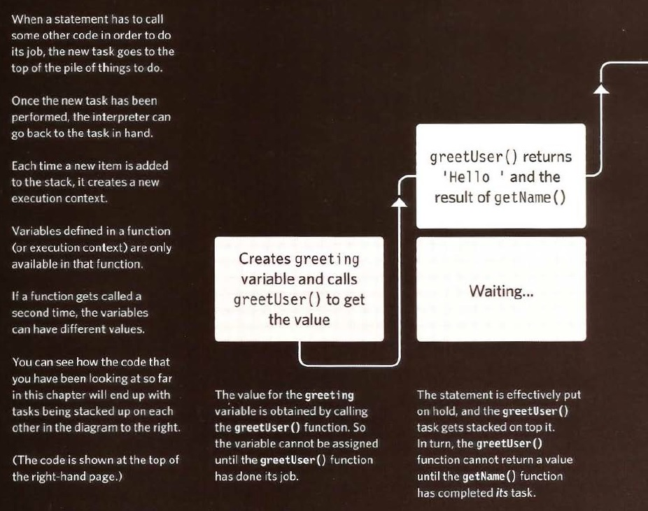
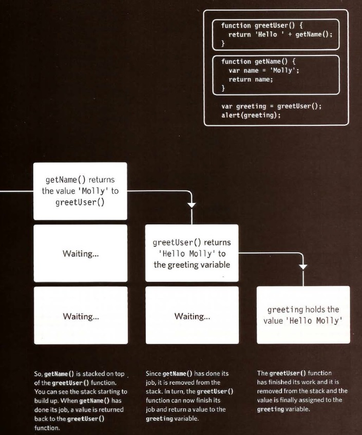
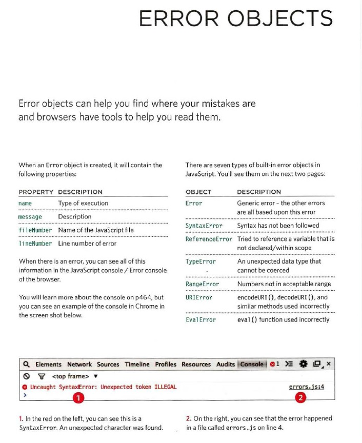

# JS Debugging

>Debugging is the process of finding errors. It involves a process of deduction.

There is one global execution context; plus, each function creates a new execution context. They correspond to variable scope.

## Execution context

Execution context (EC) is defined as the environment in which the JavaScript code is executed. By environment, I mean the value of this, variables, objects, and functions JavaScript code has access to at a particular time.

Execution context in JavaScript is of three types:

* Global execution context

* Functional execution context

* Eval

## Scope chain

The scope chain is a list of all the variable objects of functions inside which the current function exists. Scope chain also consists of the current function execution object.

## The Stack

## EXECUTION CONTEXT & HOISTING

Every function invocation has both a scope and a context associated with it. Fundamentally, scope is function-based while context is object-based. In other words, scope pertains to the variable access of a function when it is invoked and is unique to each invocation. Context is always the value of the this keyword which is a reference to the object that “owns” the currently executing code.

>JavaScript is a single threaded language, meaning only one task can be executed at a time. When the JavaScript interpreter initially executes code, it first enters into a global execution context by default. Each invocation of a function from this point on will result in the creation of a new execution context.

### Hoisting

Hoisting is JavaScript’s default behavior of moving all declarations to the top of the current scope (to the top of the current script or the current function).

### Errors

If a JavaScript statement generates an error, then it throws an exception.
At that point, the interpreter stops and looks for exception-handling code.

### HOW TO DEAL WITH ERRORS

1: DEBUG THE SCRIPT TO FIX ERRORS

>If you come across an error while writing a script (or when someone reports a bug), you will need to debug the code, track down the source of the error, and fix it. You will find that the developer tools available in every major modern browser will help you with this task. In this chapter, you will learn about the developer tools in Chrome and Firefox. (The tools in Chrome are identical to those in Opera.) IE and Safari also have their own tools (but there is not space to cover them all).

2: HANDLE ERRORS GRACEFULLY

>You can handle errors gracefully using try, catch, throw, and f i na 1 ly statement s. Sometimes, an error may occur in the script for a reason beyond your control. For example, you might request data from a third party, and their server may not respond. In such cases, it is particularly important to write error-handling code. In the latter part of the chapter, you will learn how to gracefully check whether something will work, and offer an alternative option if it fails.
